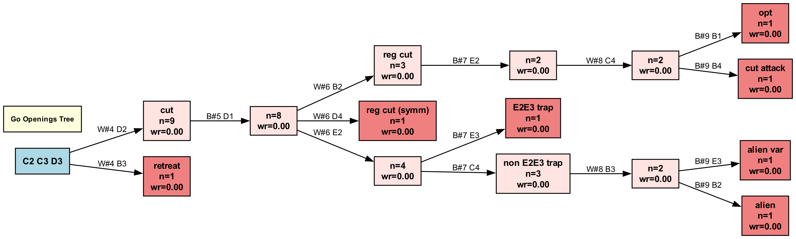

# dynamics of selfplay evolution
As mentioned [before](https://hyu2000.github.io/go5/5x5-complexity.html), the C2 opening of 5x5 Go is a great case-study for the AlphaZero algorithm: 
complex enough (>4 billion states), yet much lighter on compute.

It's interesting to examine how the model evolves over time. Mainline gives us a conveniently simple view: what the 
model thinks of the best game it can possibly play. It is very one-dimensional, but selfplay games all center around 
the mainline. (This is another advantage of 5x5 Go: we can try to assess the games ourselves.)

In the beginning, the games are pretty random. For the C2 opening, the first concept it grasps is that C3 is pretty 
important, leads us to the C2 C3 opening. Then it would try various moves, focuses on C2 C3 D3. For the first 4 moves,
the two main branches are C2 C3 D3 D2 and C2 C3 D3 B3. Various patterns would emerge, shift, and maybe resurface later.

Below is a frequent pattern (mp8.try5 run):
- one of the earlier openings where black wins the C2 opening is the "cut" pattern:
C2 C3 D3 D2 D1 D4 E2 B3 E4 C4 [main_model17-75130708168.sgf](https://hyu2000.github.io/go5/view-games.html)
It happens to be an optimal C2 opening. 
- But a few generations in, white move#6 will switch to E2:
C2 C3 D3 D2 D1 *E2 E3* B2 E1 C4 [main_model22-75134276643.sgf](https://hyu2000.github.io/go5/view-games.html)
which typically results in a black loss.
- After another wile, black will respond different in move#7: E3 to C4, then it started to win again. 
C2 C3 D3 D2 D1 E2 *C4* B3 B2 D4 [main_model29-75141160098](https://hyu2000.github.io/go5/view-games.html)
- Later, it would go back to the very first cut pattern again, this time it's much higher quality if you follow along. 
C2 C3 D3 D2 D1 D4 E2 B3 E4 D5 .. 29 .. -- -- 	B+0.5 [main_model35-75145549876](https://hyu2000.github.io/go5/view-games.html)

Coincidentally, I went through the same [revelation](https://hyu2000.github.io/go5/5x5-complexity.html) a while back myself,
which is probably why I was able to recognize this.

The question is, can we explain and understand this evolution? Neural networks, like LLMs, are notoriously 
inscrutable. 

# 5x5 Go openings roadmap
After examining many AZ runs, I was able to recognize some patterns.
This, in a way, reflects the intricacies of Go. When bot first encounters a pattern, luck might be a big part of it:
it wins the game for the wrong reason. As it keeps exploring, it would realize better counter-moves -- the game
ends up in a different way. Then black found a better counter to white's counter-move, the result flips again.

Over time, I built this mental map of milestones of the C2 openings. I use it to help understand/debug the progress
of a training run.

The C2C3D3B3 opening (not expanded in the picture) is a little more involved than the "cut" opening. 
Many times it leads to big fight / seki / ko in the end. I have yet to understand it more myself.

# trickery, blind-spots
I noticed before that 5x5 Go can be very tricky, but these games (found in selfplay) took it to another level.

[weird-bwin-as-white-ran-out-of-moves.rp2.sgf](https://hyu2000.github.io/go5/view-games.html)
To any Go player, the result of this game is a complete surprise. Black wins the game despite the fact that it has 
only one eye, but white has two (unconditionally alive). The rule I used is Chinese area scoring, basic Ko, komi 0.5.
White lost in part due to Ko (the exact Ko rule does not matter). Were it a bigger 
board, it can play a nuisance move 
somewhere, then capture back the Ko and kill off black. But here it's stuck: there is no place to
put down another stone. And black knew exactly how to take advantage of the opportunity by proactively passing.
  
While one might brush this aside as a rarity, I would rather change the game rule to end a game on 3 passes 
instead of 2. In a way, this is the familiar reward hacking of RL: it would exploit a loophole if one can be found.
As we push training to the limit, we will see more such "weird" games.

[debate.adv-weakness-move39.sgf](https://hyu2000.github.io/go5/view-games.html)
Black has killed all white at move 29. But now it's in an unchartered waters. White is rewarded by its perseverance
and good fortune. It turned the whole game around after black #41.

This shows how adversarial attack can unfold, even on a tiny board.
